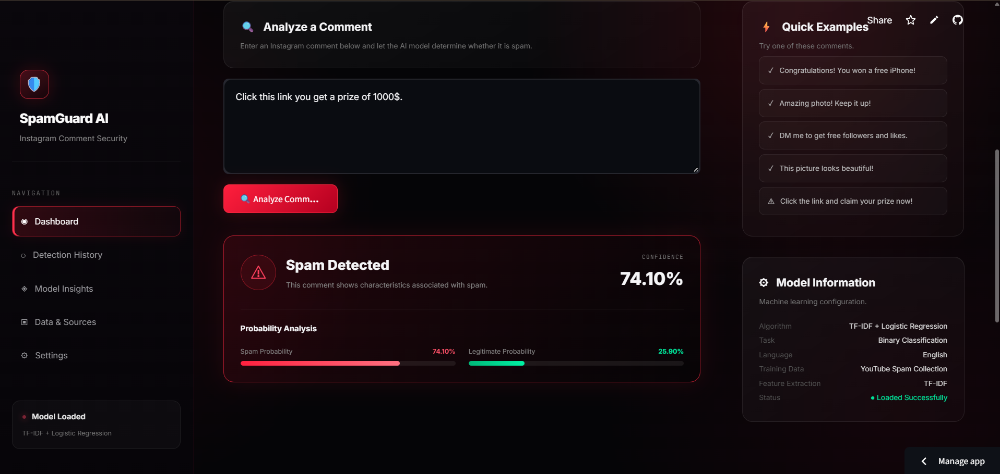
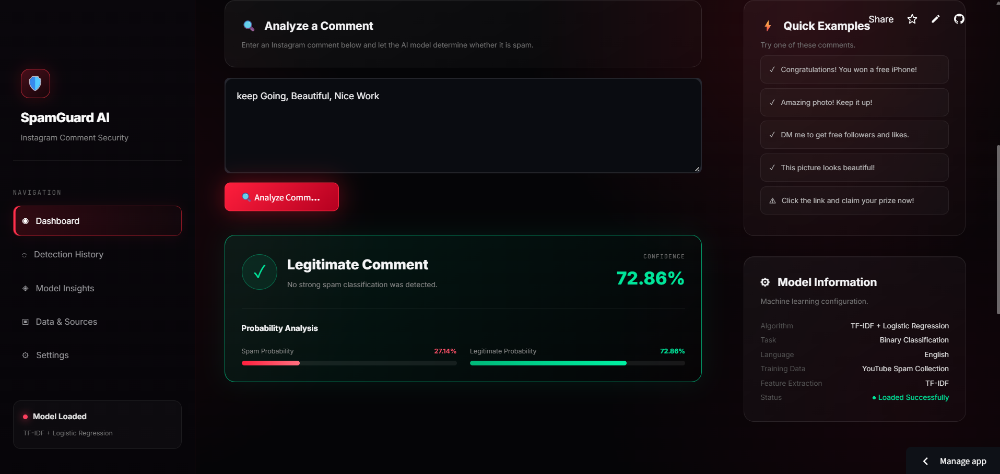

An AI-powered Instagram spam comment detection system built with Python and Streamlit. The application uses Natural Language Processing and Machine Learning to analyze comments and identify whether they are SPAM or NOT SPAM, along with a confidence score.

  
 
  
 
  

✨ Features
🤖 AI Spam Detection: Automatically classifies Instagram comments as spam or legitimate.
🧠 NLP-Based Classification: Uses text preprocessing and TF-IDF feature extraction for comment analysis.
📊 Confidence Score: Displays the model's confidence for each prediction.
⚡ Real-Time Prediction: Enter a comment and instantly receive the classification result.
🎨 Interactive Dashboard: Modern Streamlit interface designed for easy interaction.
📈 Prediction Visualization: Clearly displays spam detection results and confidence information.
🔐 Security-Focused UI: Dashboard designed around an Instagram comment security and spam-monitoring theme.
🛠️ Technologies Used
Python
Streamlit
Scikit-learn
Pandas
NumPy
TF-IDF Vectorization
Logistic Regression
Natural Language Processing (NLP)
🧠 Machine Learning Workflow

The system follows a simple NLP-based classification pipeline:

Instagram Comment
       ↓
Text Preprocessing
       ↓
TF-IDF Vectorization
       ↓
Machine Learning Model
       ↓
Spam / Not Spam Prediction
       ↓
Confidence Score
🚀 Getting Started
Prerequisites
Python 3.9+
A terminal/command prompt
Git
Installation
Clone the repository:
git clone https://github.com/YOUR-USERNAME/instagram-spam-detection.git
Navigate to the project directory:
cd instagram-spam-detection
Create a virtual environment:
python -m venv venv
Activate the virtual environment:

Windows:

venv\Scripts\activate

macOS/Linux:

source venv/bin/activate
Install the required dependencies:
pip install -r requirements.txt
▶️ Run the Application

Start the Streamlit application:

streamlit run app.py

The application will open in your browser at:

http://localhost:8501
🔍 Example
Input
Congratulations! You won a free prize. Click here to claim now!
Output
Prediction: SPAM
Confidence: High

The model analyzes the comment using TF-IDF features and predicts whether the text represents spam.

📂 Project Structure
instagram-spam-detection/
│
├── app.py
├── requirements.txt
├── README.md
│
├── models/
│   ├── spam_model.pkl
│   └── tfidf_vectorizer.pkl
│
├── data/
│   └── raw/
│       └── Youtube01-Psy.csv
│
└── screenshots/
    ├── spam1.png
    ├── spam2.png
    └── spam3.png
📊 Model

The project uses:

TF-IDF Vectorizer for converting text into numerical features.
Logistic Regression for classifying comments.
Probability prediction to provide the confidence associated with the classification.
🌐 Live Demo

🚀 Try the application:
https://YOUR-APP-NAME.streamlit.app/
